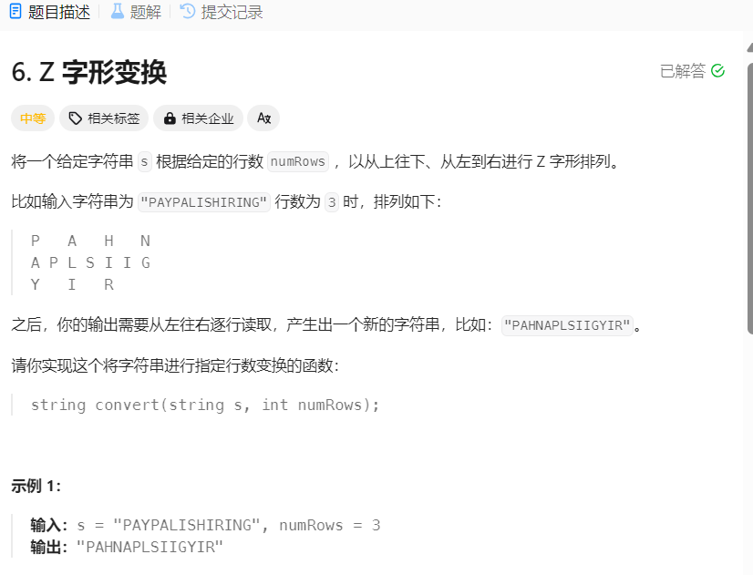
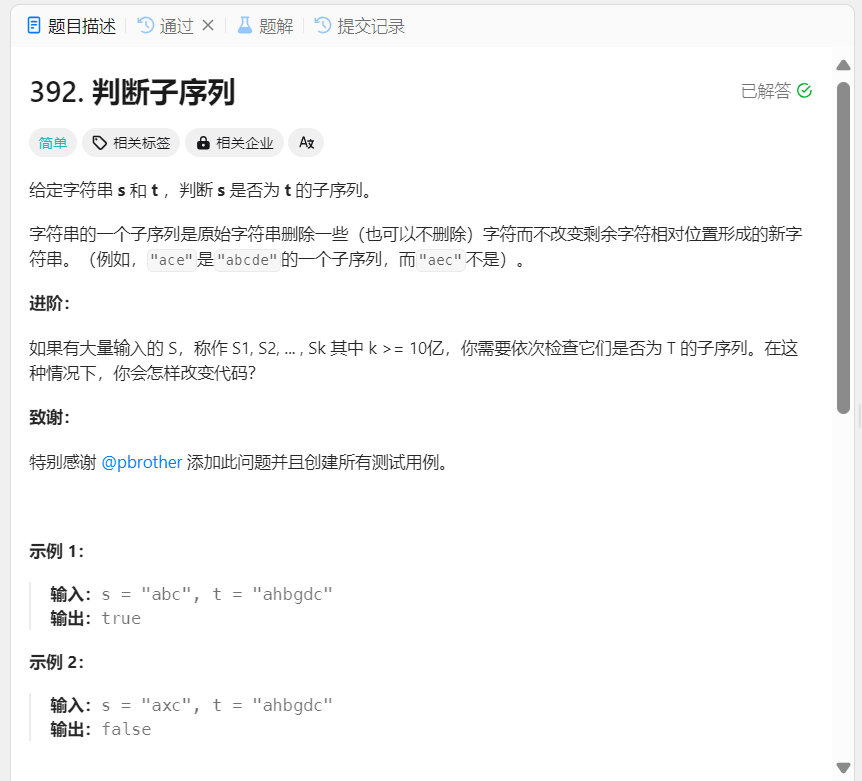

### Z字变换



```cpp
class Solution {
public:
    string convert(string s, int numRows) {
        if(numRows < 2) return s;   // 当一行的时候直接返回
        
        std::vector<std::string> rows(numRows);
        int i = 0;
        int flag = -1;      // 初始化向上
        for(char c:s)
        {
            rows[i].push_back(c);
            if(i == 0 || i == numRows -1)
            {
                flag = -flag;   // 改变放向
            }   // if
            i+=flag;
        }   // for

        std::string res;
        for(const std::string &row:rows)
        {
            res+=row;
        }
        return res;
    }
};
```

### 子序列


```cpp
class Solution {
public:
    bool isSubsequence(string s, string t) {
        int i = 0;
        int j = 0;
        while(i<s.size() && j<=t.size())
        {
            if(s[i] == t[j])
            {
                i++;
            }
            j++;
        }

        return i == s.size();  // 当i==s.size()的时候，说明比较完成了
        
    }
};

```


